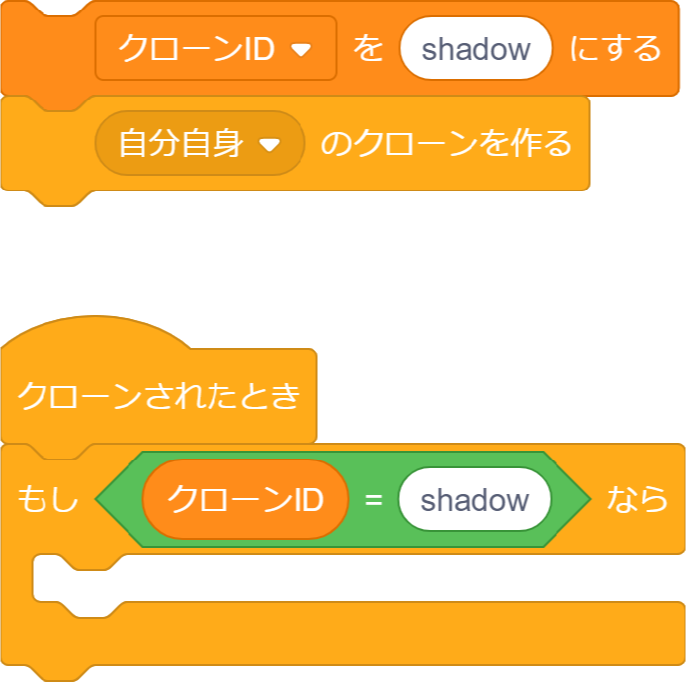

#         introの仕組み

こんにちは！今回はintroはどういう仕組みでできているのかざっくり説明します。

##         introは1スプライトで作る

まず、いっぱんにintroの中核は1スプライトにより作られます。  

その1スプライトの中で、クローンを使ったり、凄い人だと、Penでintroを作ったりもします。  

Penによるintroを「Pen」という単語と「intro」という単語を合わせて、「Pentro」と言ったりします。  

##         クローンを使ってintroを作る

基本は、変数を使ってクローンを作るときに自身を識別させます。  

見本は、「shadow」というIDのクローンを作ることにします。  

  

こういった感じのプログラムです。

あとは、自分のセンスでデザイン、構成を行っていきましょう。

##        まとめ

頑張れ！(((

